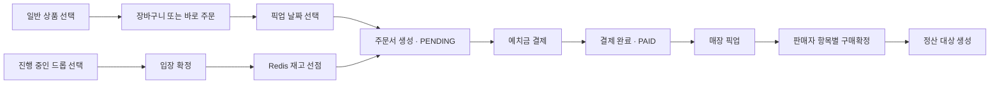
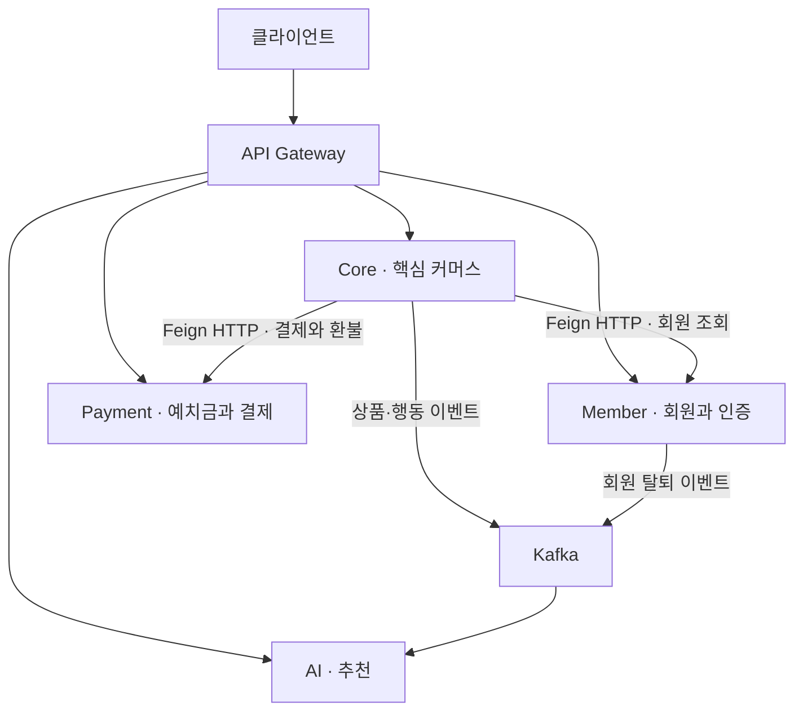

# 🥐 OpenBake

[OpenBake 메인 화면]


Link: https://bakery-site6-fe.vercel.app/

# 🥐 프로젝트 소개

**한정판 베이커리 상품 드롭 커머스 플랫폼**

OpenBake는 한정 수량 베이커리 상품을 온라인에서 미리 확보하고 원하는 날짜에 매장에서 픽업하는 드롭 커머스 플랫폼입니다. 
<br>
최근 37도 폭염 속에서 200명이 넘는 인원이 빵을 사기 위해 줄을 서다 쓰러지는 사고가 있었는데, 이렇게 오랜 시간을 기다렸음에도 재고가 소진되면 결국 상품을 구매하지 못하고 돌아가야 합니다.
<br>
매장 역시 이를 해결하기 위해 SNS DM으로 예약을 받지만 밀려드는 메시지를 수작업으로 응대해야 하기 때문에 운영 부담이 큽니다.
<br>
저희는 여기서 "왜 구매 가능 여부도 확실치 않은데 오랜 시간 줄을 서야 할까"라는 질문에서 출발해 구매가 확정되는 시점을 매장 대기열에서 온라인 드롭으로 옮기고 매장은 결제까지 끝난 주문을 픽업만 처리하도록 분리했습니다.
<br>
소비자는 정해진 시각에 열리는 드롭에서 재고를 먼저 확보한 뒤 지정한 날짜에 매장을 방문하면 되고
점주는 드롭을 등록하는 것만으로 재고, 주문, 정산이 자동으로 처리되어 반복적인 DM 예약 응대에서 벗어날 수 있습니다.
<br><br>
이를 통해 구매가 불확실한 상태로 줄을 서다 발생하는 안전사고 위험을 줄이고 점주의 운영 부담을 낮추는 것이 OpenBake의 목표입니다


---

## 주요 기능

| 영역 | 구현 내용 |
| --- | --- |
| 회원·인증 | 회원가입·로그인, Google OAuth/OIDC, JWT 인증, Redis 기반 토큰 관리 |
| 판매자 | 입점 신청·승인, 정산 계좌 관리 및 암호화 |
| 상품·검색 | 일반 상품 등록·조회·수정, Elasticsearch 검색·자동완성, S3 이미지 업로드 연동 |
| 드롭 | 판매 시간·수량 관리, 입장 확정, Redis Lua 기반 재고 선점 |
| 장바구니 | 일반 상품 담기·수량 변경·삭제, 항목별 픽업 날짜 선택 |
| 주문 | 일반 상품 바로 주문·장바구니 주문·드롭 주문, 주문서 생성과 결제 분리, 취소·만료 처리 |
| 결제 | Toss Payments 예치금 충전, 예치금 차감·환불, 멱등키 기반 중복 결제 처리 |
| 구매확정·정산 | 판매자의 항목별 구매확정, 자동 구매확정, 정산 대상 생성·월 정산 배치·지급 관리 |
| 추천 | Kafka 행동 이벤트 수집, 상품 임베딩과 사용자 행동 기반 추천·의미 검색 |

---

## 구매 흐름

회원은 로그인 후 예치금을 충전하고, 상품의 판매 방식에 따라 주문을 진행합니다.



- **드롭은 장바구니를 거치지 않습니다.** `lock-start`에서 재고를 선점한 뒤 주문서를 생성합니다.
- **일반 상품은 결제 성공 후 재고를 차감합니다.** 차감에 실패하면 환불로 보상합니다. 장바구니에 담는 것만으로 재고를 확보하지는 않습니다.
- **주문서 생성과 결제는 별도 단계입니다.** 결제 결과가 불확실하면 즉시 실패로 처리하지 않고, 동일한 멱등키로 결과를 조회합니다.
- **구매확정은 주문 항목 단위입니다.** 한 주문에 여러 판매자의 상품이 포함될 수 있으며, 판매자는 자신의 항목을 확정합니다.

---

## 서비스 구성



| 모듈 | 역할 |
| --- | --- |
| 루트 애플리케이션 (`src/`) | 판매자·상품·드롭·장바구니·주문·정산 및 행동 이벤트 기록 |
| `member-service` | 회원 정보, 로그인·인증, 토큰 관리 |
| `payment-service` | 예치금 계좌, 충전, 주문 결제·환불 |
| `ai-service` | 이벤트 소비, 상품 임베딩, 개인화 추천·의미 검색 |
| `api-gateway` | 외부 API 라우팅, JWT 검증, CORS 처리 |
| `common` | 공통 응답·예외·보안 및 이벤트 인프라 |
| `common-logging` | 공통 로깅·추적 설정 |

Core·Member·Payment·AI는 각각 별도 PostgreSQL 데이터베이스를 사용합니다.
Redis는 드롭 재고·토큰·캐시, Elasticsearch는 상품 검색·벡터 검색에 사용합니다.

주문 결제는 Order가 Payment를 동기 호출하며 조정합니다. 결제 실행(`pay`)의 원격 호출 전후로
Order DB 트랜잭션을 분리하지만, 취소·최종 구매확정의 원격 호출까지 모두 같은 방식으로 분리된 것은 아닙니다.
추천용 행동 이벤트는 Outbox를 거쳐 Kafka로 전달하고, **구매확정 → 정산은 Core 내부 Spring 이벤트**로 전달합니다.

---

## 🛠️ 기술 스택

**언어·서버·빌드**


**데이터·재고·배치**


**인증·서비스 연동**


**검색·추천·파일**


**배포·운영**


**모니터링·테스트**


---

## 로컬 실행

아래는 **인프라는 Docker, 애플리케이션은 로컬 JVM**에서 실행하는 방법입니다.
JDK 21, Docker Engine과 Docker Compose v2, Git이 필요합니다. Gradle은 저장소의 Wrapper를 사용합니다.

### 1. 저장소와 환경변수 준비

```bash
git clone https://github.com/prgrms-be-adv-devcourse/beadv7_7_BakerySite6_BE.git
cd beadv7_7_BakerySite6_BE
cp .env.example .env
```

[`.env.example`](.env.example)을 바탕으로 `.env`를 수정합니다. 예제의 키나 자리표시자를 실제 운영에 사용하지 마세요.

| 설정 | 확인할 내용 |
| --- | --- |
| `DB_URL`, `MEMBER_DB_URL`, `PAYMENT_DB_URL`, `AI_DB_URL` | 서비스별 DB 주소. 로컬 포트는 각각 `5432`, `5434`, `5435`, `5436` |
| `DB_USERNAME`, `DB_PASSWORD` | Compose PostgreSQL 계정과 일치하도록 설정 |
| `REDIS_HOST`, `REDIS_PORT` | 로컬 Redis 주소·포트 |
| `KAFKA_BOOTSTRAP_SERVERS`, `ELASTICSEARCH_URIS` | 로컬 Kafka·Elasticsearch 주소 |
| `JWT_SECRET`, `GOOGLE_CLIENT_ID` | JWT 서명키와 Google 로그인 설정 |
| `GATEWAY_JWT_ENABLED` | Gateway JWT 검증 활성화. 예제 값은 `true` |
| `MEMBER_SERVICE_URL`, `PAYMENT_SERVICE_URL`, `CORE_SERVICE_URL`, `AI_SERVICE_URL` | 서비스 간 HTTP 주소 |
| `AI_SERVICE_TOKEN`, `CORE_SERVICE_TOKEN` | 내부 API 인증 토큰. 호출·수신 서비스에 일치하는 값 설정 |
| `TOSS_SECRET_KEY` | 예치금 충전 연동용 Toss 테스트 키 |
| `SETTLEMENT_ENCRYPTION_KEY` | Base64로 인코딩한 32바이트 정산 계좌 암호화 키 |
| `AWS_ACCESS_KEY`, `AWS_SECRET_KEY` | 현재 Core 설정이 참조하는 S3 자격 증명 |
| `S3_BUCKET_NAME`, `S3_REGION` | 사용할 S3 버킷·리전 |
| `OPENAI_API_KEY` | 상품 임베딩 생성에 사용하는 API 키 |

> **환경 파일 보완:** 현재 `.env.example`은 AWS 키를 `AWS_ACCESS_KEY_ID`, `AWS_SECRET_ACCESS_KEY`로 적고 있지만,
> Core의 `application.yml`과 Compose는 `AWS_ACCESS_KEY`, `AWS_SECRET_KEY`를 참조합니다.
> `.env`에 실제로 참조하는 변수명을 추가해야 합니다. 중복된 `OPENAI_API_KEY`, `AI_SERVICE_TOKEN`, `CORE_SERVICE_TOKEN` 항목도 하나씩 정리하세요.

정산 암호화 키는 `openssl rand -base64 32`로 생성할 수 있습니다.
자격 증명과 `.env`는 Git에 올리지 않습니다.

### 2. 인프라와 Kafka 토픽 준비

```bash
docker compose up -d --wait \
  postgres member-postgres payment-postgres ai-postgres \
  redis elasticsearch kafka

docker compose run --rm kafka-init
docker compose ps
```

Elasticsearch 이미지는 Nori 분석기를 포함해 빌드합니다.
Kafka는 토픽 자동 생성을 비활성화했으므로 `kafka-init`으로 이벤트·DLT 토픽을 준비합니다.
이 절차에서는 Docker의 애플리케이션 컨테이너·Nginx·Certbot을 실행하지 않습니다.

### 3. 애플리케이션 실행

각 서비스는 **별도 터미널**에서 실행합니다. 모든 터미널에서 프로젝트 루트로 이동하고,
먼저 직접 준비한 환경 파일을 불러옵니다. 아래 명령은 Bash/zsh 기준입니다.

```bash
set -a
source .env
set +a
```

다음 표의 명령을 각각 실행합니다. Gateway는 Core와 포트가 겹치지 않도록 `8089`를 지정합니다.

| 서비스 | 실행 명령 | 이 안내의 포트 |
| --- | --- | --- |
| Member | `./gradlew :member-service:bootRun` | `8081` |
| Payment | `./gradlew :payment-service:bootRun` | `8082` |
| Core | `./gradlew :bootRun` | `8080` |
| AI | `./gradlew :ai-service:bootRun` | `8083` |
| Gateway | `./gradlew :api-gateway:bootRun --args='--server.port=8089'` | `8089` |

> `run-all.sh`는 Core·Member·Payment·Gateway를 순차 실행하는 별도 로컬 스크립트입니다.
> `up/down/restart/logs` 하위 명령은 지원하지 않으며, AI·Kafka·Elasticsearch와 Kafka 토픽 준비도 포함하지 않습니다.
> 전체 구성을 확인하려면 위 절차를 사용하세요.

### 4. 상태 확인

```bash
curl http://localhost:8080/actuator/health
curl http://localhost:8081/actuator/health
curl http://localhost:8082/actuator/health
curl http://localhost:8083/actuator/health
curl http://localhost:8089/actuator/health
```

클라이언트 API 기본 주소는 `http://localhost:8089`입니다.
Core의 Swagger UI는 [Gateway를 통한 문서](http://localhost:8089/swagger-ui/index.html)에서 확인할 수 있습니다.
서비스별 요청·응답은 각 컨트롤러와 해당 서비스의 OpenAPI 문서를 확인하세요.

---

## 주요 API

아래는 공개 API의 일부입니다. 보호된 API는 `Authorization: Bearer <accessToken>` 헤더가 필요합니다.
서비스 간 `/internal/**` API는 클라이언트 호출용이 아닙니다.

| 기능 | 메서드 | 경로 |
| --- | --- | --- |
| 회원가입 | `POST` | `/api/v1/auth/signup` |
| 로그인 | `POST` | `/api/v1/auth/login` |
| 예치금 충전 요청·승인 | `POST` | `/api/v1/deposit/charges`, `/api/v1/deposit/charges/confirm` |
| 일반 상품 목록·검색 | `GET` | `/api/v1/products/product-list` |
| 오늘의 드롭 ID 목록 | `GET` | `/api/v1/drops/today/drops` |
| 드롭 입장 확정 | `POST` | `/api/v1/drops/{dropId}/confirm-entry` |
| 드롭 재고 선점 | `POST` | `/api/v1/drops/{dropId}/lock-start` |
| 장바구니 담기 | `POST` | `/api/v1/cart/items` |
| 장바구니 픽업 날짜 변경 | `PATCH` | `/api/v1/cart/items/{cartItemId}/pickup-date` |
| 주문서 생성 | `POST` | `/api/v1/orders` |
| 주문 결제 | `POST` | `/api/v1/orders/{orderId}/pay` |
| 주문 취소 | `PATCH` | `/api/v1/orders/{orderId}/cancel` |
| 항목 구매확정 — 판매자 | `PATCH` | `/api/v1/orders/items/{orderItemId}/confirm` |
| 판매자 판매내역 | `GET` | `/api/v1/sellers/me/orders` |
| 개인화 상품 추천 | `GET` | `/api/v1/recommendations` |

[Postman 컬렉션](postman/OpenBake_Payment_API.postman_collection.json)은 **결제 API용**이며,
전체 서비스 API를 포함하는 명세서는 아닙니다.

---

## 빌드·테스트

```bash
# 전체 모듈 빌드·기본 테스트
./gradlew build

# 전체 기본 테스트
./gradlew test

# 주문·장바구니 테스트만 실행
./gradlew :test --tests '*Order*Test' --tests '*Cart*Test'

# 특정 서비스 테스트
./gradlew :payment-service:test

# AI 통합 테스트 — Docker 필요
./gradlew :ai-service:integrationTest
```

AI 통합 테스트는 기본 `test`와 분리되어 있습니다.
[CI](.github/workflows/ci.yml)는 Redis·Elasticsearch를 준비한 뒤
`./gradlew build :ai-service:integrationTest`를 실행합니다.
로컬 전체 검증에서도 테스트에 필요한 인프라를 먼저 준비하세요.
부하·초과 판매 검증은 [k6 실행 안내](performance-test/README.md)를 참고하세요.

---

## 프로젝트 구조

```text
.
├── src/                  # Core: 판매자·상품·드롭·장바구니·주문·정산
├── member-service/       # 회원·인증
├── payment-service/      # 예치금·결제
├── ai-service/           # 추천·임베딩·이벤트 소비
├── api-gateway/          # API 라우팅·인증
├── common/               # 공유 코드
├── common-logging/       # 공통 로깅·추적
├── elasticsearch/        # Nori 분석기를 포함한 이미지
├── monitoring/           # Prometheus·Grafana 구성
├── instrumentation/      # 성능 계측 도구
├── performance-test/     # k6 부하 테스트
├── postman/              # 결제 API 컬렉션
├── k8s/                  # Kubernetes 리소스·Kustomize 설정
├── nginx/                # 리버스 프록시 설정
├── scripts/              # 운영·인프라 보조 스크립트
├── .github/workflows/    # CI·배포 워크플로
├── docker-compose.yaml   # 로컬 서비스·인프라 구성
└── settings.gradle       # Gradle 모듈 정의
```

주요 커머스 도메인은 `domain`(도메인 모델·규칙), `application`(유스케이스),
`infrastructure`(저장소·외부 연동), `presentation`(API) 계층으로 구성합니다.

---

## 배포·모니터링

- [배포 워크플로](.github/workflows/deploy.yml)는 `develop` 브랜치 push 시 이미지를 GHCR에 게시하고, Kustomize로 Kubernetes 리소스에 반영합니다. 실행에는 배포 환경과 GitHub Secrets 설정이 필요합니다.
- [Kubernetes 구성](k8s/)에는 서비스·데이터 저장소·네트워크 정책·관측 리소스가 있습니다. 이미지 태그·Secret·스토리지 등 환경별 설정을 확인한 뒤 적용해야 합니다.
- [로컬 Compose 오버라이드](docker-compose.local.yaml)와 [배포 이미지 오버라이드](docker-compose.prod.yaml)가 있습니다. 이 파일들만으로 운영 환경의 인증서·자격 증명 설정이 완료되지는 않습니다.
- [모니터링 실행 안내](monitoring/README.md)에 따라 Prometheus·Grafana를 별도로 실행할 수 있습니다. 기본 애플리케이션 Compose에 함께 포함되어 있지는 않습니다.
- Micrometer Tracing으로 서비스 간 추적 정보를 전달합니다. 외부 추적 저장소로 내보내려면 별도 exporter 설정이 필요합니다.
